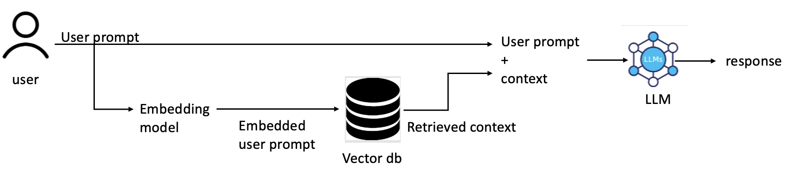

# RAG-Tool
This is a Retrieval Augmented Generation (RAG)-based tool designed for expanding GPT-3.5-turbo-16k LLM's knowledge domain and enhancing its answers on latest NLP trends including transformer models available on HuggingFace as well as the LangChain Framework documentation.

Before staring make sure you have the following:
1. OpenAI API Key (https://platform.openai.com/docs/quickstart?context=python)
2. Cohere AI API Key (https://docs.cohere.com/docs)
3. An index in Pinecone (https://www.pinecone.io/)
# How to Setup
Follow these instructions to run the program
### Setup the environment variables
Copy .env.example file into .env

```shell
cp .env.example .env
```

After copying the environment variables into .env file, fill them in
OPENAI_API_KEY=Your OpenAI API Key

PINECONE_ENVIRONMENT_512=Your Pinecone Environment for storing data that is split using 512 chunk-size ("gcp-starter" if using the default free version)

PINECONE_ENVIRONMENT_1024=Your Pinecone Environment for storing data that is split using 1024 chunk-size ("gcp-starter" if using the default free version)

PINECONE_512_INDEX_API_KEY=The API Key of the index that is going to store data that is split using 512 chunk-size

PINECONE_1024_INDEX_API_KEY=The API Key of the index that is going to store data that is split using 1024 chunk-size

PINECONE_512_INDEX_NAME=The name of the index where you store data that is split using 512 chunk-size

PINECONE_1024_INDEX_NAME=The name of the index where you store data that is split using 1024 chunk-size

COHERE_API_KEY=Your Cohere API Key

### Install Necessary Dependencies

```shell
pip3 install -r requirements.txt
```

### Load Data into Pinecone
Before loading data, make sure that you have LangChain documentation stored locally on your computer. In order to have that you can download it from the following link: https://drive.google.com/file/d/13djlL_W_VVKELxbaXuyUhz5RvkVISqVB/view?usp=sharing
Once you download it, navigate to load_data.py file, and, if needed, change "langchain-docs" in lines 138, 139 to the location that you store langchain-docs folder in.


Run the following command to load the data into Pinecone

```shell
python3 load_data.py
```

### Get the USer-Interface
If you want to interact with the model that uses 512 chunk-size to partition data, run the following:

```shell
streamlit run conversation/gpt_with_data_512.py
```

If you want to interact with the model that uses 1024 chunk-size to partition data, run the following:

```shell
streamlit run conversation/gpt_with_data_1024.py
```
Currently, it uses top 4 chunks to generate an answer. You can modify this by modifying the parameter k in lines 72 (for 512 chunk-size) and 103 (for 1024 chunk-size) and set it the number of chunks that you want to use for answer generation.

# Model Evaluation
There are 4 different files used for evaluating the models
Firstly, run the following command:

```shell
 export OPENAI_API_KEY="Your API Key" 
```
If you want to run evaluations for the architecture that uses a chunk size of 512 (no rerank), run the following:

```shell
python3 evaluation_calculations/evaluation_calculation_512.py
```

If you want to run evaluations for the architecture that uses a chunk size of 512 (with rerank), run the following:

```shell
python3 evaluation_calculations/evaluation_calculation_512_rerank.py
```

If you want to run evaluations for the architecture that uses a chunk size of 1024 (no rerank), run the following:

```shell
python3 evaluation_calculations/evaluation_calculation_1024.py
```

If you want to run evaluations for the architecture that uses a chunk size of 1024 (with rerank), run the following:

```shell
python3 evaluation_calculations/evaluation_calculation_1024_rerank.py
```

# Architecture
Our project pipeline is based on Retrieval-Augmented Generation (RAG) architecture and is used to enable gpt-3.5-turbo-16k model to answer questions regarding the latest developed transformer models available on HuggingFace as well as the LangChain Framework documentation. Both of the mentioned data sources are primarily outside of the model's training set, preventing it from generating responses on questions based on those topics.
It uses RAG architecture to overcome this limitation. This includes the following: firstly, data that we collected on transformer models and LangChain documentation must be stored in a Pinecone, which is a vector-store. The data that we collected is recursively split into pieces (chunks) of data using predefined chunk-size (either 512 or 1024 in our case). Once the user writes a question (prompt), it is converted to a vector using an embedding model (text-embedding-ada-002). Then, the embedding vector is used to search for the most similar chunks of data in our Pinecone index. Afterwards, the similar chunks are retrieved and then re-ranked using Cohere Rerank based on the relevance of those chunks to the given question. Then, the k (predefined by us) most similar chunks are provided as a context to the LLM (gpt-3.5-turbo-16k) to generate a response. The usage if RAG architecture based on official documentation data, reduces the risk of hallucinated responses by the LLM. 



# Team
